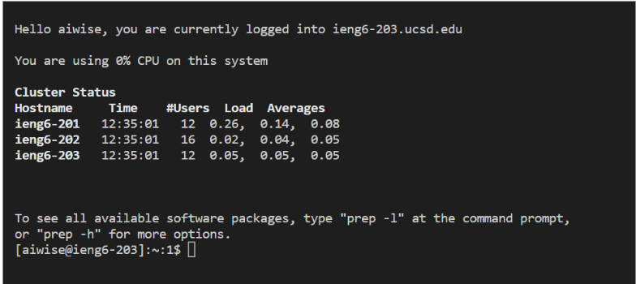
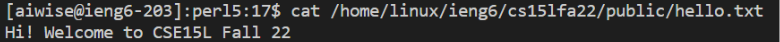
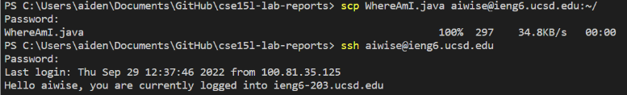
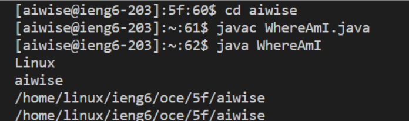
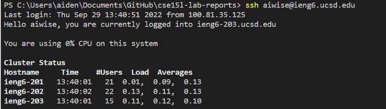
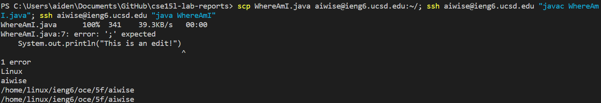

# Lab Report Week 1


## Step 1 Installing VS Code
Open the [VS Code Website](https://code.visualstudio.com/) and follow the instructions to download it in your system.
After installing open the application and an application that looks like this should open up.


## Step 2 Remotely Connecting
To begin open the terminal in VSCODE by clicking (Ctrl + ` )

You can choose to login with either your course-specific account given by the class you are in or your ucsd login username

Once chosen type 
```
ssh (login of your choosing)@ieng6.ucsd.edu
```

When it asks you if you are sure you want to continue type yes and click enter

After of which it will ask for your password and type it in. The password does not show up but does input it into the terminal.

Once completed it should look like this



## Step 3 Try a Command
Some commands you can try when inside the server are

- cd

- ls

- ls < directory >

- cat /home/linux/ieng6/(your login)/public/hello.txt


Running the cat file Looks like this



## Step 4 Moving Files with SCP

On your computer Create a file called WhereAmI.java and copy the following code into it.

```
class WhereAmI {
  public static void main(String[] args) {
    System.out.println(System.getProperty("os.name"));
    System.out.println(System.getProperty("user.name"));
    System.out.println(System.getProperty("user.home"));
    System.out.println(System.getProperty("user.dir"));
  }
}
```
If you have java installed from your client call to compile and run it, but if you don't have it installed skip this step.

```
javac WhereAmI.java
java WhereAmI
```

Then in your terminal write

```
scp WhereAmI.java (your login)@ieng6.ucsd.edu:~/
```

It will then ask you to input your password to copy the files over.


Next login to the server again 
It should look like this



ssh and call the java commands again

```
javac WhereAmI.java
java WhereAmI
```

Your terminal should now show you information about the server and your directory.



## Step 5 Setting an SSH Key

In the terminal call

> ssh-keygen -t ed25519

When it asks you to save the file in a certain locatio click enter to create it in the default location

Then when it asks you to create a passphrase click enter so that you create an empty one

Remember the location that the file is saved in

You then want to log back into the server and call

```
mkdir .ssh
```

After call exit to logout

Then in the client copy over your key to the server

```
scp /Users/aiden/.ssh/id_rsa.pub (your login)@ieng6.ucsd.edu:~/.ssh/authorized_keys
```

You should now be able to login without a password when calling ssh



## Step 6 Optimizing Remote Running

Now you can try to optimize how fast you can do operations in the server.

A fast way to constantly edit a file that you are working on would be to write all operations in one line and when you need to do the same operation later you can click (up arrow + enter) and be able to instatly write the same code again fast.




