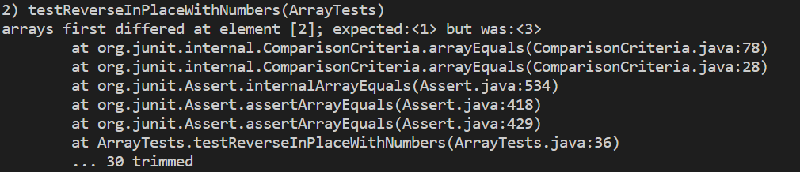

# Lab Report 2 Week 3

## Lab 2 SearchEngine Code
```
import java.io.IOException;
import java.net.URI;
import java.util.ArrayList;

class Handler implements URLHandler {
    // The one bit of state on the server: a number that will be manipulated by
    // various requests.

    ArrayList<String> list = new ArrayList<>();

    public String handleRequest(URI url) {
        if (url.getPath().equals("/")) {
            return String.format("This is the Start of the Search Engine");
        } else if (url.getPath().contains("/search")) {
            String finalResult = "";
            String[] searchResult = url.getQuery().split("=");
            if(searchResult[0].equals("s")){
                for(int i = 0; i<list.size();i++){
                    if(list.get(i).contains(searchResult[1]));
                        finalResult += ( list.get(i) + " ");
                }
                return finalResult;
            }

            return String.format(list.get(0));
        } else {
            System.out.println("Path: " + url.getPath());
            if (url.getPath().contains("/add")) {
                String[] parameters = url.getQuery().split("=");
                if (parameters[0].equals("s")) {
                    list.add(parameters[1]);
                    return String.format("Added %s to Search! The Search now has %d results", parameters[1], list.size());
                }
            }
            return "404 Not Found!";
        }
    }
}


class SearchEngine {
    public static void main(String[] args) throws IOException {
        if(args.length == 0){
            System.out.println("Missing port number! Try any number between 1024 to 49151");
            return;
        }

        int port = Integer.parseInt(args[0]);

        Server.start(port, new Handler());
    }
}
```
---
localhost:1345


**Method** add   : **Values** apple,apple2,apple3 

Seperated by s= after the ?

/add?s=apple , /adds?s=apple2 , /add?s=apple3


**Method** Search : **Value** app

Seperated by s= after the ?

/search?s=app


---


## Lab 3 Tests

**Test 1**

**Failure Inducing Input**


**Symptoms**


**Bug Fix**


The Failure inducing input for ReverseInPlace() was an input of the array {1,2,3}; When I expected {3,2,1}, the Symptom was {3,2,3}. This tells me that there is a bug in the way the code assigns the values to the position on the array. Upon further inspection the bug was that the code already assigned values within the same array so when it got to the point of switching the first and last variable it had already been overridden with 3 so 3 stayed as the last number.

**Test 2**

**Failure Inducing Input**


**Symptoms**


**Bug Fix**


The Failure inducing input for reversed() is {1,2,3}. When I expected a new Array with the values {1,2,3} I got the symptom i got was that it returned 0 and the first index. This tells me there is probably a bug with how an array gets set with values.
