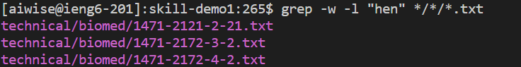

# Lab Report 4 Week 5

## Grep Command Line options
---
**grep -w**

This command option makes it so grep only searches for the exact word input into it rather than if it was only a part of a word like hi -> hill , app -> apple ,  and hen -> henry. This can be helpfull if the word you want to find could easily be a prefix or suffix of other words

---

**grep -l**

This command option makes it so grep only tells you the file you are searching for rather than all the lines it found it on. This can be helpful if you only need the file name or want to pipe the outputs of grep into another command.

---

**grep -n**

This command options makes it so grep will print out which lines it found the pattern on exactly. This could be helpful if you want to be able to know which lines that the pattern was found on.

