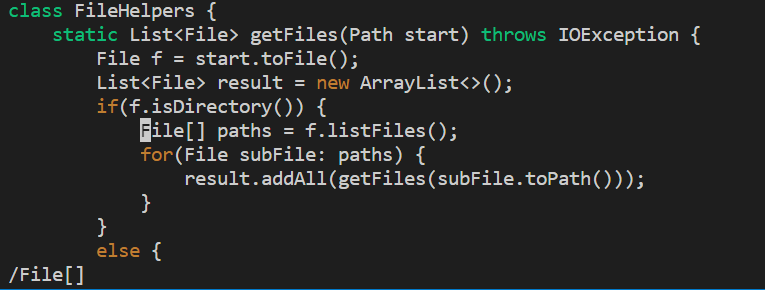
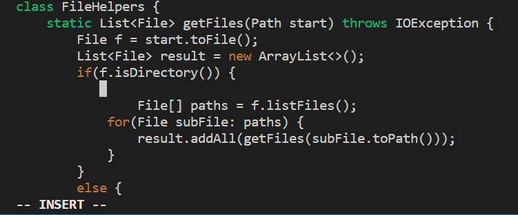
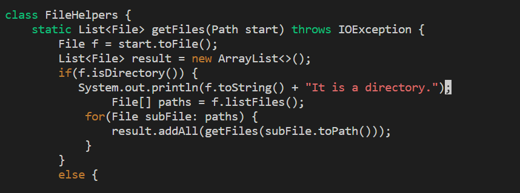

# Lab Report 5 Week 7
## vim commands

In DocSearchServer.java, add a new line right before File[] paths = f.listFiles(); that prints out the toString of f and a message saying it’s a directory.


```
/File[] <Enter> i <Enter> <Escape> k i System.out.println(f.toString() + “. It is a directory.”); <Escape> :wq <Enter>
```

```
/File[] <Enter>
```



```
 i <Enter> <Escape> k i 
```


```
System.out.println(f.toString() + “. It is a directory.”); <Escape>
```


```
:wq <enter>
```

## Part 2

It took me 2 min and 13 seconds to copy the file over with vsCode and only took me 32 Seconds in Vim. It takes longer because you have to access the server multiple times throughout uploading it to the server.

1. I find it more convienent to edit it with vim when I am already on the server but because I already understand how to edit on VScode and scp it its easier to do for me.

2. If I had to change pieces of code already on a server vim would be better than downloading editing and then re-uploading however, if not doing this task I would prefer to edit it in VScode.
