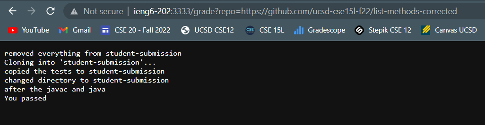
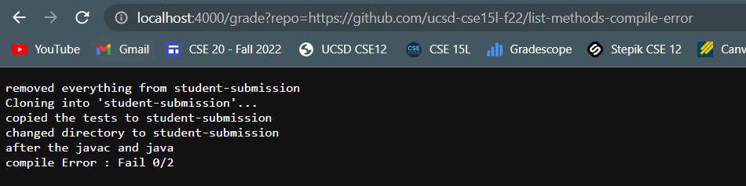
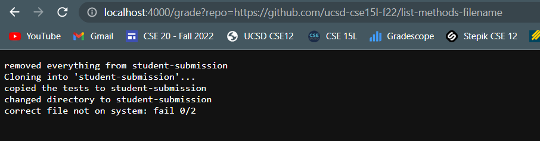

# Bash Grade

---

## Trace

In the above bash the first command called is to remove everything from the folder. This line itself does not contain any standard output but I echoed "removed everything from student-submission".

The next line cloning into 'student-submission'... comes from the git clone command which is standard output

the next line copied the tests to student-submission comes after the line in which I cp'ed the tests into the same file and I echoed that line

I then cd'ed into student-submission and echoed it again

I then have an if statment that checks if the file ListExamples exist within the folder. In this case it does so it continues.

After I javac all the java files inside student-submission I echo again. The standard error is sent to a file called compileError.txt

I then have an if statment that checks if anything is inside that file. If there is then the code exits and returns the line "compile error: fail 0/2"
